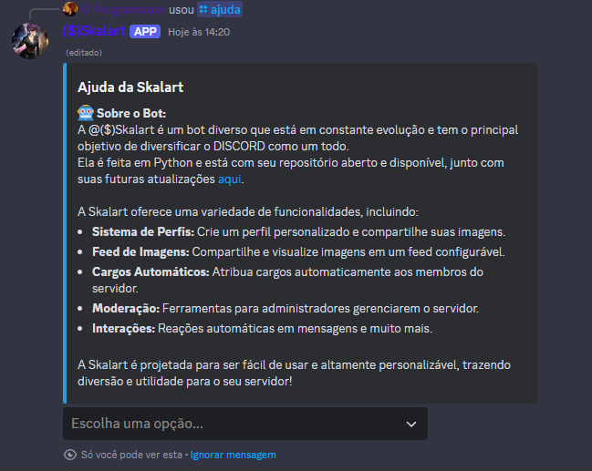
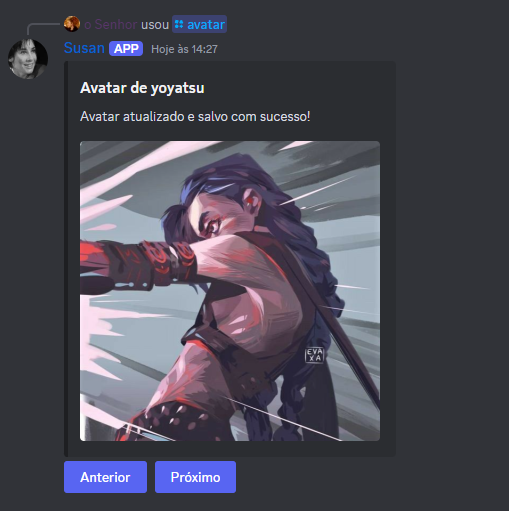
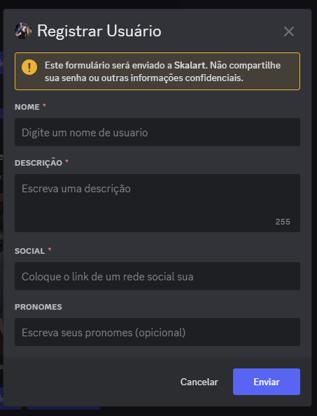
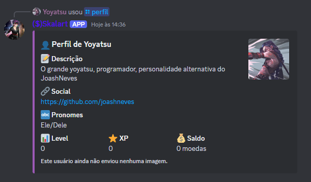
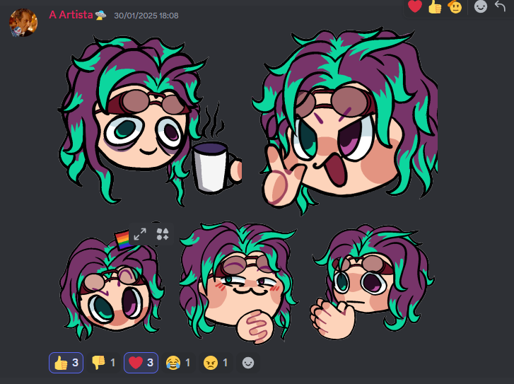
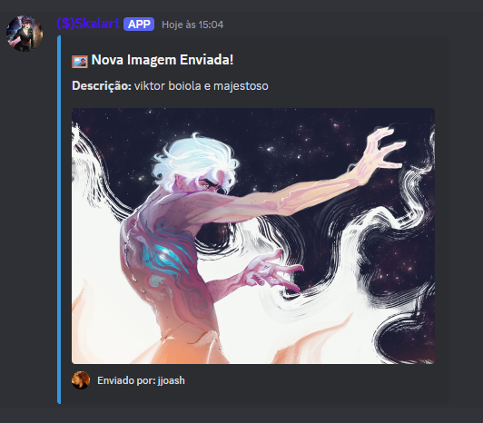

# Comandos
Aqui estão os comandos do bot

- [Gerais](#gerais)
- [Registrado](#registrados)
- [Adms](#administração)

## Gerais

### /ajuda
Seu comando inicial sendo para ajudar aqueles que convidaram o bot

ele vai mostrar informações sobre o bot sendo essas informações sobre :
- Sobre o bot
- Comando gerais
- Comando perfil
- Comando imagens
- Comando imagens
- Comando Ticket
- Cargos
- Feed
- Links

## / Avatar

O comando avatar vai mostrar todos os avatares da pessoa ja registrado, se voce usar o /avatar o bot vai colocar seu ou o avatar da pessoa mencionada em um historico, e mostrar os avatares que ele salvou

## / Registrar

o comando / Registrar é o comando que voce vai utilizar para cadastrar um perfil no bot, com seu perfil feito voce sera capaz de mandar imagens para o banco de dados do bot, **caso voce ja tenha se registrado, ele vai atualizar seu perfil**
Para se registrar voce envia as informações de
- Nome : Nome que vai ficar no seu perfil
- Descrição : A descrição do perfil com no maximo 255 caracteres
- Social : Url ou @ de uma rede social sua para as pessoa poderem entrar em contato
- Pronomes : pronomes para se referir a ti (opcional)

## / Perfil

Mostrar o perfil seu ou da pessoa mencionada, assim como todas as imagens que a pessoa ja enviou
> Voce só pode pegar o perfil de uma pessoa registrada

## /imagem_aleatoria

o `/imagem_aleatoria` te retonar uma imagem aleatoria que esta salva no banco de dados do bot
> Se quiser saber mais [Clique aqui](./extras.md)

## /enviar_ticket

Caso esteja configurado no seu servidor, o usuario poderar abrir um ticket _Uma conversa privada com os adms_

## / usuarios_registrados

Exiber uma lista dos usuarios que estão registrados no sistema do bot

# Registrados
**Esses comandos podem ser enviados somente por quem é registrado**

## / adicionar_imagem
> Requer : [imagem] e [descrição]

Para enviar uma imagem, voce apenas precisa escrever o comando, e anexar um arquivo de imagem, e uma descrição para ela enviar em todos os chats que estão configurados como `feed` nos servidores que ela esta

## / minhas_imagens
Esse comando vai te retonar uma lista de todas as imagens que voce ja enviou

## / remover_imagem
> Requer : [imagem_id]

Para remover uma imagem que voce enviou voce precisa digitar o comando /remover_imagem, e enviar o id da imagen que voce quer remover
> Voce pode conseguir o id com o comando `/minhas_imagens`

# Administração
Esses comandos podem ser executados somente pela administração do servidor

## / configurar_cargo
> Requer : [cargo]

Voce pode colocar um cargo que voce deseja que pessoa tenha OU *VARIOS CARGOS PARA DESCIDIR ALEATORIAMENTE*
#### Exemplo
Voce colocar 3 cargos no bot : `time_1` / `time_2` / `time_3`
Quando alguem novo entrar no seu servidor o bot vai descidi entre os 3 cargos e aplicar para o usuario rescem chegado

## / listar_cargos
Lista todos os cargos configurados

# / remover_cargo
> Requer : [cargo]

 Remove um cargo da lista de cargos

# /configurar_chat
> Requer : [Chat]

Configura um canal para reagir com emojis em mensagens de imagens, quando voce mandar uma mensagem no canal especificado ele não faz nada, mas se for uma imagem ele reage com os emoticons
### Exemplo

# /listar_chats
Lista todos os canais configurados para reações

# /remover_chat
> Requer : [Chat]

Remove um canal da lista de reações

# /configurar_feed
> Requer : [Chat]

Configura um canal para que quando voce envie uma imagem, todos os servidores que possuem esse feed nele possam receber a imagem do comando [/adicionar_imagem](#-adicionar_imagem)
### Exemplo

# /listar_feeds
Lista todos os canais configurados para feeds

# /remover_feeds
> Requer : [Chat]

Remove um canal da lista de feeds
